<div align="center">

# 🏭 ERP · Modul WMS

### Procure-to-Pay · Order-to-Cash · Make-to-Order, dalam satu modul ERP

Warehouse • Procurement • Sales • Production • Finance • Accounting — satu alur terkontrol, langsung terintegrasi ke jurnal akuntansi.

[](https://laravel.com)
[](https://php.net)
[](https://www.mysql.com)
[](https://tailwindcss.com)
[](#-pengujian)

</div>

<br>

> 🧩 **Bukan WMS berdiri sendiri.** Setiap pergerakan gudang — terima barang, pakai barang, retur, opname — langsung memengaruhi hutang dan general ledger secara real-time (*perpetual inventory*), bukan sekadar catatan administratif yang diserahkan ke sistem finansial lain.

<br>

## 📋 Daftar Isi

| | | | |
|---|---|---|---|
| [📦 Gambaran Umum](#-gambaran-umum) | [🏗️ Standar Arsitektur](#️-standar-arsitektur) | [🔀 Alur Bisnis](#-alur-bisnis) | [🔄 Lifecycle Dokumen](#-lifecycle-dokumen) |
| [🧩 Modul Aktif](#-modul-aktif) | [🏬 Multi Gudang](#-multi-gudang) | [🏭 Gudang Produksi](#-gudang-produksi) | [👥 Role & Akses](#-role--akses) |
| [🔑 Akun Development](#-akun-development) | [⚙️ Menjalankan Lokal](#️-menjalankan-secara-lokal) | [✅ Pengujian](#-pengujian) | [🚀 Deployment](#-catatan-deployment) |

<br>

## 📦 Gambaran Umum

**ERP · Modul WMS** menghubungkan proses:

<div align="center">

**Beli:** `📝 Request` → `🛒 PO` → `📥 LPB` → `🏬 Multi Gudang` → `🔧 NPK` → `🧾 Faktur Pembelian` → `💳 Pembayaran`

**Jual:** `👤 Pelanggan` → `📋 Pesanan Penjualan` → `🚚 Surat Jalan` → `🧾 Faktur Penjualan` → `💰 Penerimaan`

**Produksi:** `📋 Pesanan Penjualan` → `🏭 Perintah Kerja` → `🔧 NPK ke WIP` → `✅ Selesai` → `🚚 Surat Jalan`

`📚 Semuanya bermuara ke Jurnal Akuntansi`

</div>

Dokumen operasional tidak berhenti sebagai catatan administratif — LPB, NPK, surat jalan, faktur, pembayaran, perintah kerja, dan stock opname ikut memengaruhi stok, nilai persediaan, hutang, piutang, barang dalam proses, dan general ledger **di saat yang sama**.

<br>

## 🏗️ Standar Arsitektur

- 🗂️ Route dipisahkan per domain — `routes/auth.php`, `warehouse.php`, `procurement.php`, `finance.php`, `accounting.php`, `assets-and-services.php`.
- 🎯 Controller = HTTP orchestration saja; validasi wajib di `app/Http/Requests`, proses lintas model di `app/Services`.
- 🔐 Policy ditemukan otomatis lewat konvensi Laravel. Gate hanya untuk capability lintas model.
- 🔡 Nama class dan file mengikuti PSR-4 dengan casing identik.
- 🏷️ Nama tabel plural `snake_case`; foreign key baru memakai pola `<model>_id`.
- 🔢 Kuantitas `DECIMAL(18,6)`, unit cost `DECIMAL(18,4)`, uang `DECIMAL(18,2)`, tarif `DECIMAL(8,4)` — tidak ada floating point untuk data bisnis.
- 🔒 Status database selalu machine code UPPERCASE. Label Bahasa Indonesia hanya di presentation layer.
- 🚫 Dokumen posted tidak diedit/dihapus — koreksi lewat void/reversal + audit metadata + jurnal pembalik.

> Architecture test menjaga aturan ini agar nama legacy, floating point data bisnis, inline validation, route monolitik, dan class/file mismatch tidak masuk kembali.

Pemeriksaan casing yang sama dengan runner Linux, dijalankan dari Windows:

```bash
composer test:case-sensitive
```

Menjalankan strict PSR-4 Composer + membandingkan casing class, import `App\...`, nama file lokal, dan path yang benar-benar disimpan Git.

<br>

## 🔀 Alur Bisnis

### Diagram alur

```mermaid
flowchart LR
    A["📝 Request Barang"] --> B["✅ Approval"]
    B --> C["🛒 Purchase Order"]
    C --> D["📥 LPB / Penerimaan"]
    D --> E["🏬 Stok + Layer FIFO"]
    E --> F["🔧 NPK / Pemakaian"]
    D --> G["🧾 Faktur Pembelian"]
    G --> H["🕵️ Approval Manager"]
    H --> I["💳 Pembayaran"]
    F --> J["📚 Jurnal Akuntansi"]
    I --> J

    L["👤 Pelanggan"] --> M["📋 Pesanan Penjualan"]
    M --> N["🏭 Perintah Kerja"]
    F --> N
    N --> O["🔨 Barang Dalam Proses"]
    E --> P["🚚 Surat Jalan"]
    M --> P
    O --> P
    P --> Q["🧾 Faktur Penjualan"]
    Q --> R["💰 Penerimaan Pembayaran"]
    P --> J
    Q --> J
    R --> J

    J --> K["📊 Laporan Keuangan"]

    style A fill:#38BDF8,color:#0B1120
    style B fill:#FBBF24,color:#0B1120
    style C fill:#818CF8,color:#0B1120
    style D fill:#34D399,color:#0B1120
    style E fill:#34D399,color:#0B1120
    style F fill:#F472B6,color:#0B1120
    style G fill:#FB923C,color:#0B1120
    style H fill:#FBBF24,color:#0B1120
    style I fill:#FB923C,color:#0B1120
    style J fill:#A78BFA,color:#0B1120
    style K fill:#22C55E,color:#0B1120
    style L fill:#38BDF8,color:#0B1120
    style M fill:#818CF8,color:#0B1120
    style N fill:#F472B6,color:#0B1120
    style O fill:#F472B6,color:#0B1120
    style P fill:#34D399,color:#0B1120
    style Q fill:#FB923C,color:#0B1120
    style R fill:#FB923C,color:#0B1120
```



### Tabel alur

| # | Tahap | Aktor | Dokumen/Aksi | Output |
|:-:|---|---|---|---|
| 1 | 📝 Request | Semua role *kecuali* Purchasing | Material Request | Kebutuhan tercatat, status `PENDING` |
| 2 | ✅ Approval | Purchasing / Accounting | — | Status `APPROVED`; bahan baru otomatis dibuat kalau belum ada di master |
| 3 | 🛒 Purchase Order | Purchasing | PO | Komitmen pembelian ke supplier |
| 4 | 📥 Penerimaan | Warehouse | LPB / BAP | Stok + layer FIFO terbentuk, jurnal Persediaan ↔ GRNI |
| 5 | 🔧 Pemakaian | Warehouse / Produksi | NPK | Layer FIFO berkurang, jurnal Beban ↔ Persediaan |
| 6 | 🧾 Invoice | Purchasing | Faktur Pembelian | GRNI → Hutang Usaha, status `PENDING_APPROVAL` |
| 7 | 🕵️ Approval Invoice | **Accounting Manager** | — | Invoice diposting ke jurnal, siap dibayar (maker-checker) |
| 8 | 💳 Pembayaran | Finance | Pembayaran Faktur | Hutang berkurang, jurnal Kas/Bank, PPh dipotong |
| 9 | 📊 Pelaporan | Accounting | Laporan Keuangan | Lima laporan PSAK 1 (Laba Rugi, Neraca, Arus Kas, Perubahan Ekuitas, CALK) plus Neraca Saldo & Buku Besar — HTML/PDF/Excel |

<br>

## 🔄 Lifecycle Dokumen

| Dokumen | Lifecycle standar |
|---|---|
| 📝 Material Request | `PENDING` → `APPROVED` / `REJECTED` → `FULFILLED` (otomatis saat semua item sudah di-PO-kan penuh) |
| 🛒 Purchase Order | `OPEN` → `CLOSED` |
| 📥 LPB / BAP | `DRAFT` → `POSTED` → `REVERSED` atau `CANCELLED` |
| 🔧 NPK | `DRAFT` → `POSTED` → `REVERSED` |
| 🧾 Invoice Supplier | `PENDING_APPROVAL` → `UNPAID` → `PARTIALLY_PAID` → `PAID` atau `VOID` |
| 💳 Pembayaran Invoice | `POSTED` → `VOID` |
| ↩️ Retur Pembelian | `POSTED` → `REVERSED` (mengurangi hutang invoice atau jadi uang muka supplier bila sudah lunas) |
| 🚚 Transfer Gudang | `DRAFT` → `DIAJUKAN` → `DIKIRIM` → `DITERIMA` atau `DIBATALKAN` |
| 📋 Stock Opname | `DRAFT` → `SUBMITTED` → `APPROVED` → `POSTED` atau `REJECTED` |
| 📋 Pesanan Penjualan | `OPEN` → `CLOSED` (otomatis saat seluruh baris terkirim penuh) atau `DIBATALKAN` |
| 🚚 Surat Jalan | `DRAFT` → `POSTED` → `REVERSED` — posting mengurangi stok FIFO dan membentuk jurnal harga pokok |
| 🧾 Faktur Penjualan | `DRAFT` → `POSTED` → `PARTIALLY_PAID` → `PAID` atau `VOID` |
| 💰 Penerimaan Pembayaran | `POSTED` → `VOID` |
| ↩️ Retur Penjualan | `POSTED` — stok kembali sebagai layer baru, faktur berkurang |
| 🏭 Perintah Kerja | `DRAFT` → `DIRILIS` → `SELESAI` → `DITUTUP` atau `DIBATALKAN`. **Setelah `SELESAI` tidak menerima biaya baru** — harga pokok per unit sudah dikunci |
| 🗳️ Permintaan Persetujuan | `PENDING` → `APPROVED` / `REJECTED` — pemohon tidak boleh menyetujui permintaannya sendiri |

<br>

## 🧩 Modul Aktif

| Area | Modul | Fungsi Utama |
|---|---|---|
| 🗃️ Master | Supplier | Data pemasok, termin, kontak |
| 🗃️ Master | Bahan | Kategori, gudang, satuan utama/kecil, planning |
| 🛍️ Procurement | Request | Pengajuan kebutuhan + approval (terbuka untuk semua role kecuali Purchasing) |
| 🛍️ Procurement | PO Barang | Pembelian barang, realisasi request, histori revisi |
| 📦 Warehouse | Penerimaan Barang (LPB) | Penerimaan barang terhadap PO |
| 📦 Warehouse | Pemakaian Barang (NPK) | Pemakaian barang, pengurangan layer FIFO |
| 📦 Warehouse | Retur Pembelian | Retur sebelum *atau sesudah* invoice/pembayaran posting, otomatis jadi uang muka bila perlu |
| 📦 Warehouse | Multi Gudang | Saldo per gudang, transfer, mutasi, planning, Consider, Rusak |
| 📦 Warehouse | Stock Opname | Hitung fisik, approval accounting, koreksi stok |
| 💰 Finance | Faktur Pembelian | Penggabungan LPB/BAP jadi tagihan, PPN Impor, referensi mata uang asing |
| 💰 Finance | Pembayaran | Pembayaran parsial/penuh, PPh 23/22/4(2) Final, biaya bank, materai, uang muka |
| 📊 Accounting | Bagan Akun (COA) & Mapping | Mapping persediaan, beban, GRNI, akun global |
| 📊 Accounting | Jurnal | Jurnal otomatis, jurnal manual, reversal |
| 📊 Accounting | Approval Invoice | Maker-checker — role **Accounting Manager** khusus approve invoice sebelum posting |
| 📊 Accounting | Laporan Keuangan | Neraca Saldo, Buku Besar, Laba Rugi, Neraca, Arus Kas, Perubahan Ekuitas, CALK — export PDF & Excel (**lima laporan PSAK 1 lengkap**) |
| 📊 Accounting | Antrean Persetujuan | Maker-checker untuk jurnal manual, pembalikan dokumen, dan perubahan bagan akun/mapping |
| 🛒 Purchasing | Lacak Pembelian | Sebaran nilai satu penerimaan: masih stok, jadi beban, selisih opname, retur |
| 🛒 Purchasing | Kartu Skor Supplier | Lead time, ketepatan terhadap target, nilai belanja, rasio retur, rasio reject QC |
| 💰 Sales | Pelanggan | Master pelanggan: termin, plafon kredit, piutang berjalan |
| 💰 Sales | Pesanan Penjualan | Pesanan pelanggan dengan DPP/PPN, ditarik jadi surat jalan |
| 💰 Sales | Surat Jalan | Pengeluaran barang: konsumsi FIFO + jurnal harga pokok penjualan per gudang |
| 💰 Sales | Faktur Penjualan | Piutang usaha + PPN Keluaran, NSFP wajib untuk faktur ber-PPN |
| 💰 Sales | Penerimaan & Retur | Pelunasan piutang bertahap dan retur penjualan yang mengembalikan stok |
| 🏭 Produksi | Perintah Kerja | Job costing aktual: material dan jasa menumpuk di Barang Dalam Proses, dilepas saat pengiriman |
| 📊 Accounting | Dashboard Eksekutif | Tren nilai persediaan, aging hutang, top supplier, biaya per kategori (chart) |
| 📊 Accounting | Kontrol | Kunci periode, tarif pajak, rekonsiliasi |
| 🏢 Asset | Aset Tetap | Perolehan, penyusutan (garis lurus & saldo menurun, manual/otomatis), pelepasan |
| 🧰 Jasa | Pesanan & Penerimaan Jasa (BAP) | Jasa operasional/produksi, progress BAP |
| 🧰 Jasa | Kapitalisasi Jasa ke Aset | Jasa yang menambah masa manfaat masuk nilai tercatat aset (PSAK 16), bukan beban |
| 🧰 Jasa | Barang Keluar ke Vendor | Gate pass: barang kita keluar untuk diperbaiki lalu kembali — catatan kustodian, tanpa jurnal |
| 🧰 Jasa | Barang Titipan Vendor | Unit pinjaman vendor selama perbaikan — di luar neraca, bukan persediaan maupun aset |
| 🏢 Asset | Tukar Tambah (Trade-in) | Pelepasan aset via barter: PPN Keluaran atas nilai wajar, nilainya jadi uang muka supplier |
| 🛰️ WMS Control | Traceability | Bin, lot, serial, expiry, block/release |
| 🛰️ WMS Control | Warehouse Execution | QC, putaway, reservation, FEFO/FIFO picking |
| 🛰️ WMS Control | Financial Control | Three-way match, landed cost, controlled reversal |
| 🛰️ WMS Control | Planning | Reorder point, safety stock, replenishment suggestion |
| 🛰️ WMS Control | Antrean Kerja Operator | "Tugas saya": QC, putaway, picking, terima transfer, opname — dibatasi gudang yang boleh diakses |
| 🛰️ WMS Control | Gelombang Pengambilan | Wave/batch picking: gabungkan banyak perintah ambil jadi satu gelombang, urut jalur bin |
| 🛰️ WMS Control | Slotting ABC | Saran pemindahan bin: barang cepat bergerak ke bin dekat jalur ambil |
| 🛰️ WMS Control | Kitting & Bundling | Rakit/urai kit dari beberapa bahan, nilai FIFO komponen pindah utuh ke kit |
| 📦 Warehouse | Cycle Count ABC | Hitung fisik parsial per kelas ABC — A bulanan, B triwulan, C tahunan |
| 📈 Semua Dashboard | Task Grid + Chart | Setiap role melihat seluruh tugas outstanding-nya sebagai kartu yang bisa diklik, plus grafik ringkasan |

<br>

## 🏬 Multi Gudang

Jenis gudang aktif:

| Jenis | Arti |
|---|---|
| 🟢 `NORMAL` | Gudang operasional biasa |
| 🟡 `CONSIDER` | Karantina / status belum pasti |
| 🔴 `RUSAK` | Barang rusak, final |

**Aturan penting:**

- LPB masuk ke gudang tujuan PO.
- NPK mengurangi stok dari gudang asal yang dipilih.
- Transfer antar gudang mempertahankan nilai layer (FIFO cost ikut berpindah).
- Gudang Consider diproses lewat pemeriksaan Consider.
- Gudang Rusak bersifat final.
- **Akses gudang dibatasi per orang.** Super Admin melihat semua gudang; operator Warehouse dan Produksi hanya melihat gudang yang ditugaskan lewat **Pembagian Gudang**. Operator baru mulai tanpa gudang dan harus ditugaskan lebih dulu.

Transfer memakai standar `DRAFT → DIAJUKAN → DIKIRIM → DITERIMA`. Saat dikirim, barang berada di layer `IN_TRANSIT`; saldo global perusahaan **tidak berubah** sampai diterima. Selisih penerimaan dipertahankan sebagai exception rekonsiliasi.

Standar transaksi inventory lainnya:

- ✅ Dokumen posted bersifat immutable.
- ✅ Koreksi LPB/NPK lewat controlled reversal, bukan edit/delete.
- ✅ Setiap reversal memulihkan saldo, FIFO, komitmen PO, dan jurnal dalam satu transaksi.
- ✅ Transfer memakai idempotency key untuk menolak request ganda.
- ✅ NPK hanya mengonsumsi layer `AVAILABLE`, tidak blocked, belum expired.
- ✅ Picking mengurutkan lot dengan FEFO lalu FIFO.
- ✅ Rekonsiliasi wajib: master quantity = gudang + transit; saldo gudang = layer; nilai layer = GL persediaan.
- ✅ Invoice supplier lewat three-way matching PO–LPB–Invoice sebelum jurnal hutang diposting.
- ✅ Landed cost dikapitalisasi ke layer aktif, diposting seimbang ke GL.
- ✅ Kapasitas bin dicek dua arah: total unit **dan** volume (kalau dimensi bin dan volume bahan terisi).
- ✅ Perakitan kit mengonsumsi komponen FIFO dan memindahkan nilainya utuh ke kit — nilai tidak diciptakan.

📍 Pusat operasional fitur ini: menu **Multi Gudang → WMS Control Center**.

<br>

## 🏭 Gudang Produksi

- `Gudang Utama → Gudang Produksi` lewat `Transfer Gudang`. Sejak 2026-09-16 perpindahan internal ini **membentuk jurnal** yang netral secara total — nilainya pindah antar dimensi gudang, bukan bertambah atau berkurang.
- `NPK` dari `Gudang Produksi` adalah titik mulai pemakaian bahan.
- `Stock Opname` tetap per gudang, termasuk gudang produksi.

**Job costing (sejak 2026-09-16).** NPK yang ditandai ke sebuah **Perintah Kerja** tidak langsung jadi beban: biayanya menumpuk di `Barang Dalam Proses` bersama biaya jasa subkontrak yang dialokasikan ke perintah kerja yang sama. Saat produksi dilaporkan selesai, harga pokok per unit dikunci dan perintah kerja **berhenti menerima biaya**. Setiap pengiriman melepas WIP secara proporsional ke Beban Pokok Penjualan.

Produksi di sini selalu untuk pesanan pelanggan, jadi keluarannya **tidak dibukukan sebagai stok barang jadi** — nilainya tetap di WIP sampai dikirim. NPK **tanpa** perintah kerja perilakunya tidak berubah sama sekali.

Yang belum ada: BOM sebagai standar (sehingga belum ada selisih pemakaian material), serta penyerapan tenaga kerja dan overhead.

Seeder default membuat: `Gudang Utama`, `Gudang Produksi`, `Gudang Consider`, `Gudang Rusak`.

<br>

## 👥 Role & Akses

Role disimpan di tabel `user_roles`, direferensikan oleh kolom `users.type`.

| Type | Role | Akses Utama |
|:-:|---|---|
| 0 | 👑 SuperAdmin | Akses penuh tanpa pengecualian (`Gate::before`) |
| 1 | 🛍️ Purchasing | Supplier, request, PO, LPB, invoice, jasa, pelanggan, pesanan penjualan, perintah kerja, analitik pengadaan |
| 2 | 💳 Finance | Melihat invoice, mencatat/void pembayaran supplier, menerima pembayaran pelanggan |
| 3 | 📦 Warehouse | Operasional gudang **sesuai assignment gudang** termasuk posting surat jalan, tanpa visibilitas finansial sensitif |
| 4 | 📊 Accounting | COA, mapping, jurnal, pajak, period lock, rekonsiliasi, approval opname, aset, faktur penjualan, retur penjualan |
| 5 | 🏭 Produksi | Transfer, NPK, saldo stok, mutasi, opname sesuai assignment gudang, serta perintah kerja produksi |
| 6 | 🕵️ Accounting Manager | **Maker-checker**: approve invoice supplier, jurnal manual, pembalikan dokumen, dan perubahan COA/mapping |

**Catatan:**

- `SuperAdmin` melewati semua policy lewat `Gate::before`.
- `Warehouse` **dan** `Produksi` sama-sama dibatasi ke gudang yang di-assign di `pembagian_gudangs` (sejak 2026-09-13; sebelumnya `Warehouse` otomatis mendapat semua gudang aktif).
- Operator yang belum punya assignment tidak melihat gudang manapun — ini disengaja, agar akses lintas lokasi harus diberikan secara sadar.
- Semua role *kecuali Purchasing* sekarang bisa mengajukan Material Request; setiap user bisa melacak status request miliknya sendiri.
- **Pemohon tidak boleh menyetujui permintaannya sendiri.** Aturan itu ditegakkan di service, bukan hanya policy, sehingga `SuperAdmin` pun tidak bisa melewatinya lewat `Gate::before`.

<br>

## 🔑 Akun Development

Seeder default membuat akun berikut (khusus development/demo):

| Role | Email | Password |
|---|---|---|
| 👑 SuperAdmin | `superadmin@wms.local` | `Wms12345!` |
| 🛍️ Purchasing | `purchasing@wms.local` | `Wms12345!` |
| 💳 Finance | `finance@wms.local` | `Wms12345!` |
| 📦 Warehouse | `warehouse@wms.local` | `Wms12345!` |
| 📊 Accounting | `accounting@wms.local` | `Wms12345!` |
| 🏭 Produksi | `produksi@wms.local` | `Wms12345!` |
| 🕵️ Accounting Manager | `accounting-manager@wms.local` | `Wms12345!` |

> ⚠️ Kredensial ini **hanya** untuk development/demo — jangan pernah dipakai di production.

<br>

## ⚙️ Menjalankan Secara Lokal

### Prasyarat

- 🐘 PHP 8.2 atau lebih baru
- 📦 Composer
- 🟢 Node.js dan npm
- 🗄️ MySQL

### Instalasi

```bash
composer install
npm install
```

Buat file `.env` lokal sesuai konfigurasi Laravel, isi koneksi database.

```bash
php artisan key:generate
php artisan migrate --seed
npm run build
php artisan serve
```

Untuk frontend development:

```bash
npm run dev

# dua proses ini juga perlu jalan agar notifikasi dan penjadwalan aktif
php artisan queue:work
php artisan schedule:work
```

> 💡 `php artisan migrate --seed` membuat master data **sekaligus** data demo — pakai untuk development/test saja. Untuk production, hindari `DatabaseSeeder` penuh.

<br>

## ✅ Pengujian

<div align="center">


</div>

```bash
php artisan test                              # full suite
php artisan test --filter=TestClassName       # satu class
composer test:case-sensitive                  # cek casing ala Linux CI, dari Windows
```

Suite saat ini mencakup:

- 🔐 policy role, multi-warehouse policy, stock opname policy
- 🧮 keamanan mapping COA, payment allocation, konversi satuan, inventory cost calculation
- 🏢 asset dan service policy
- 🔑 basic feature auth
- 🛰️ WMS control, transfer in-transit, reservation/picking, three-way match, landed cost, reversal, rekonsiliasi
- 💰 PPh multi-tipe (23/22/4(2) Final), penyusutan otomatis, retur pasca-invoice, maker-checker invoice
- 📊 request workflow lintas role, dashboard per role, dashboard eksekutif, export Excel
- 📒 lima laporan PSAK 1 — Arus Kas dan Perubahan Ekuitas punya tie-out sendiri ke buku besar dan ke neraca
- 🛡️ maker-checker jurnal manual, pembalikan dokumen, dan perubahan COA/mapping
- 🏬 dimensi gudang pada baris jurnal: nilai persediaan per gudang cocok dengan nilai layer-nya
- 💰 penjualan end-to-end lewat HTTP: pesanan → surat jalan → faktur → pelunasan, plus retur penjualan
- 🏭 produksi: akumulasi WIP dari NPK, penguncian harga pokok, pelepasan proporsional saat kirim, dan invarian WIP vs buku besar

<br>

## 🚀 Catatan Deployment

- 📁 Arahkan document root ke `public/`.
- 🔓 Pastikan `storage/` dan `bootstrap/cache/` writable.
- 🐛 Gunakan `APP_DEBUG=false` di production.
- ⚡ Jalankan `php artisan optimize` setelah konfigurasi production siap.
- 🔒 Jangan commit `.env`, password, token, atau secret apa pun.

**Dua proses wajib berjalan, bukan opsional (sejak 2026-09-12):**

- ⚙️ **`php artisan queue:work`** — notifikasi persetujuan dan pengingat dikirim lewat antrean. Tanpa worker, notifikasinya mengendap di tabel `jobs` dan tidak pernah sampai. `QUEUE_CONNECTION` harus driver nyata (`database`), bukan `sync`.
- ⏰ **`php artisan schedule:work`** (atau satu entri cron) — replenishment harian, pengingat tenggat, klasifikasi ABC mingguan, dan penyusutan bulanan semuanya terjadwal. Tanpa ini sistem kembali "baru sadar kalau ada yang klik".
- 💾 Lampiran dokumen disimpan di disk privat `storage/app/lampiran` dan hanya keluar lewat route berotorisasi. Untuk pindah ke S3 cukup set `LAMPIRAN_DISK=s3`.

<br>

## 📚 Dokumentasi Lanjutan

Lihat **[feed.MD](feed.MD)** untuk:

- 🏗️ arsitektur aplikasi
- 🗄️ struktur database
- 🔐 policy dan otorisasi
- 🔀 flow inventory dan akuntansi
- 🌱 seeder dan akun demo
- 🛠️ technical debt dan rekomendasi pengembangan

---

<div align="center">

Made by **vayndem** with ❤️

</div>
