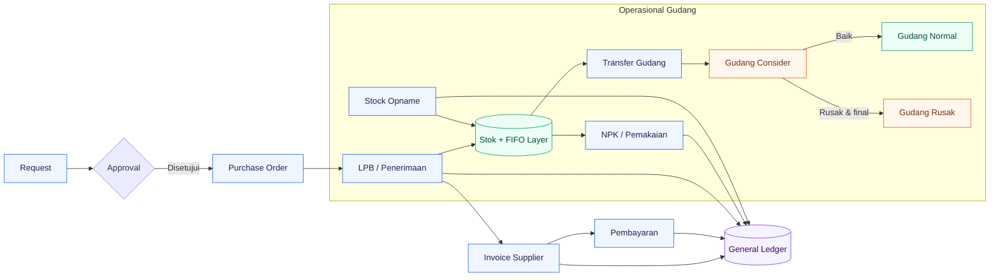

<div align="center">

# 📦 WMS FullSpec

### Warehouse, procurement, finance, dan accounting dalam satu alur yang terkontrol

<p>
  Kelola perjalanan barang sejak diminta, dibeli, diterima, disimpan di beberapa gudang,<br>
  dipakai, dihitung ulang, ditagihkan, hingga tercatat di general ledger.
</p>

<p>
  
  
  
  
  
</p>

<p>
  <a href="#-gambaran-umum">Gambaran Umum</a> •
  <a href="#-modul-aktif">Modul</a> •
  <a href="#-cara-kerja-bisnis">Alur Bisnis</a> •
  <a href="#-multi-warehouse">Multi-Warehouse</a> •
  <a href="#-menjalankan-secara-lokal">Instalasi</a> •
  <a href="feed.MD">Dokumentasi Teknis</a>
</p>

</div>

> [!NOTE]
> README ini ditujukan untuk pengguna baru, stakeholder, dan pembaca bisnis. Arsitektur, database, policy, API, aturan akuntansi, dan catatan implementasi dijelaskan lebih dalam di **[feed.MD](feed.MD)**.

---

## 🧭 Gambaran umum

WMS FullSpec menghubungkan aktivitas **Purchasing, Gudang, Finance, dan Accounting**. Dokumen operasional tidak berhenti sebagai data administratif: penerimaan dan pengeluaran membentuk layer nilai persediaan, invoice membentuk hutang, pembayaran mengurangi hutang, dan transaksi finansial menghasilkan jurnal double-entry.

<table>
<tr>
<td width="25%" align="center">
<h3>🛒 Procurement</h3>
Request, approval, PO barang, PO jasa, dan histori revisi.
</td>
<td width="25%" align="center">
<h3>🏭 Warehouse</h3>
LPB, NPK, FIFO, multi-gudang, Consider, dan stock opname.
</td>
<td width="25%" align="center">
<h3>💳 Finance</h3>
Invoice supplier, pembayaran parsial, PPh, dan uang muka.
</td>
<td width="25%" align="center">
<h3>📒 Accounting</h3>
COA, jurnal otomatis, reversal, period lock, dan rekonsiliasi.
</td>
</tr>
</table>



## ✨ Nilai utama

- 🔗 **Satu alur lintas divisi** — Request, PO, penerimaan, invoice, dan pembayaran saling terhubung.
- 📚 **Stok bernilai, bukan hanya kuantitas** — Persediaan disimpan dalam layer penerimaan dan dikonsumsi dengan FIFO.
- ⚙️ **Akuntansi otomatis** — LPB, NPK, invoice, pembayaran, stock opname, dan transaksi aset membentuk jurnal seimbang.
- 🛡️ **Kontrol berdasarkan role** — Hak melihat harga, membuat, menyetujui, membayar, dan posting dipisahkan.
- 🧾 **Audit dan koreksi terkendali** — Histori revisi, status dokumen, reversal, void pembayaran, dan period lock tersedia.
- 📊 **Pelaporan operasional** — Daftar serta dokumen utama dapat dikeluarkan sebagai PDF atau Excel.

## 🧩 Modul aktif

| Area | Modul | Fungsi utama |
|---|---|---|
| Master data | Supplier | Data pemasok, termin pembayaran, kontak, dan laporan supplier |
| Master data | Bahan | Kategori, gudang, satuan dasar/kecil, planning, dan posisi stok |
| Procurement | Request | Pengajuan kebutuhan barang dan persetujuan kuantitas |
| Procurement | Purchase Order | Pembuatan PO, detail item, pajak, diskon, ongkir, revisi, dan penutupan PO |
| Warehouse | LPB Barang | Penerimaan terhadap PO, lot, kuantitas diterima, nilai, dan pembentukan stok |
| Warehouse | NPK | Pengeluaran/pemakaian bahan, konversi satuan, serta pengurangan layer FIFO |
| Warehouse | Stock Opname | Hitung fisik, alasan selisih, persetujuan Accounting, valuasi, dan posting koreksi |
| Warehouse | Multi Gudang | Saldo per barang–gudang, transfer FIFO, kartu stok, planning, Consider, Gudang Rusak, dan rekonsiliasi |
| Accounts Payable | Invoice LPB | Penggabungan LPB/BAP ke invoice supplier, pajak, jatuh tempo, dan saldo tagihan |
| Accounts Payable | Pembayaran | Pembayaran parsial/penuh, PPh 23, biaya bank, materai, selisih, dan uang muka supplier |
| Accounting | COA dan mapping | Chart of Accounts, mapping kategori persediaan/beban/GRNI, dan akun global |
| Accounting | Jurnal | Jurnal otomatis, jurnal manual, posting, dan reversal |
| Accounting | Kontrol periode | Kunci periode transaksi dan pengelolaan tarif pajak efektif |
| Accounting | Rekonsiliasi | Perbandingan stok operasional, layer persediaan, dan nilai jurnal |
| Fixed asset | Aset perusahaan | Perolehan, penyusutan, nilai buku, penjualan/penghapusan, dan jurnal aset |
| Procurement jasa | PO dan BAP Jasa | PO jasa operasional/produksi, progres BAP, cost center/Data Pesanan, dan invoice |
| Integrasi | REST API | Identitas user aktif melalui token Sanctum pada tabel `users` |

## 🔄 Cara kerja bisnis

### 1. Procure-to-pay barang

1. Pengguna membuat **Request** berisi satu atau lebih kebutuhan bahan.
2. Purchasing atau Accounting meninjau dan menyetujui/menolak request. Kuantitas yang disetujui menjadi batas realisasi.
3. Purchasing membuat **PO** dan mengaitkan item PO dengan detail request.
4. Gudang/Purchasing membuat **LPB** ketika barang datang. Sistem memperbarui jumlah diterima, stok on-hand, dan layer biaya persediaan.
5. LPB menghasilkan jurnal persediaan terhadap GRNI (barang diterima tetapi belum ditagih).
6. Purchasing mencatat **invoice supplier** dan mengaitkannya dengan satu atau lebih LPB.
7. Invoice menyelesaikan GRNI, mencatat pajak/biaya/diskon, dan mengakui hutang supplier.
8. Finance mencatat pembayaran. Sistem menangani pembayaran sebagian, potongan PPh, biaya bank, selisih, atau kelebihan sebagai uang muka supplier.

### 2. Pemakaian barang

1. Pengguna membuat **NPK** untuk barang dan gudang asal.
2. Kuantitas transaksi dikonversi ke satuan stok bila bahan memiliki satuan kecil.
3. Sistem mengambil layer stok tertua yang masih tersedia (FIFO).
4. Stok dan saldo layer berkurang; nilai pemakaian menjadi dasar jurnal beban terhadap persediaan.

### 🏬 Multi-warehouse

| Jenis gudang | Fungsi | Aturan utama |
|---|---|---|
| 🟢 **NORMAL** | Persediaan aktif untuk penerimaan, transfer, NPK, dan opname | Barang dapat dipakai dan dipindahkan sesuai capability gudang |
| 🟠 **CONSIDER** | Area karantina untuk barang yang kondisinya belum pasti | Barang hanya dapat keluar melalui pemeriksaan Consider |
| 🔴 **RUSAK** | Penyimpanan barang yang sudah dikonfirmasi rusak | Keputusan bersifat final; barang tidak dapat kembali ke gudang aktif |

- Satu PO memiliki satu gudang tujuan.
- LPB menambah `stok_gudangs` dan layer FIFO pada gudang PO.
- NPK hanya mengambil saldo dan layer dari gudang asal yang dipilih.
- Transfer mempertahankan harga layer dan tidak membentuk jurnal selama COA persediaannya sama.
- Barang yang diragukan dipindah dari Gudang Normal ke Gudang Consider.
- Pemeriksaan Consider memisahkan jumlah baik kembali ke Gudang Normal dan jumlah rusak ke Gudang Rusak.
- Keputusan rusak yang sudah dikonfirmasi bersifat final; proses Afval akan ditambahkan pada fase berikutnya.
- Seluruh pengelolaan multi-gudang versi pertama tersedia untuk user type `14`.

> **Contoh:** 8 unit dipindahkan dari Gudang Utama ke Consider. Setelah diperiksa, 1 unit masih baik dan kembali ke Gudang Utama, sedangkan 7 unit masuk Gudang Rusak secara final. Total kuantitas dan nilai layer persediaan tetap terjaga.

### 3. Stock opname

1. Gudang membuat dokumen opname per gudang dan cutoff.
2. Gudang mengisi hasil fisik serta alasan untuk setiap selisih.
3. Dokumen diajukan kepada Accounting.
4. Accounting menilai selisih: kekurangan memakai biaya FIFO, sedangkan kelebihan memerlukan harga koreksi.
5. Setelah disetujui dan diposting, stok, layer biaya, serta jurnal koreksi diperbarui secara atomik.

### 4. Pengadaan jasa

1. Purchasing membuat PO bertipe jasa dengan kategori **operasional** atau **produksi**.
2. Penyelesaian jasa dicatat melalui BAP berdasarkan progres dan nilai pekerjaan.
3. Jasa operasional dapat meminta cost center; jasa produksi dapat meminta kode Data Pesanan.
4. BAP dapat ditagihkan lewat Invoice LPB. BAP sendiri tidak menjurnal saat dibuat; pengakuan nilai dilakukan ketika invoice diposting.

### 5. Siklus aset tetap

1. Accounting mendaftarkan aset dan sumber perolehannya.
2. Sistem membuat jurnal perolehan.
3. Penyusutan berkala menurunkan nilai buku tanpa melewati nilai residu.
4. Penjualan atau penghapusan aset menutup nilai perolehan/akumulasi dan mengakui laba atau rugi pelepasan.

## 👥 Role dan pemisahan tugas

Role disimpan langsung pada kolom `users.type`.

| Type | Peran operasional | Akses utama |
|---:|---|---|
| 5 | 🛒 Purchasing | Supplier, request approval, PO, LPB, invoice, jasa, dan visibilitas finansial operasional |
| 13 | 💳 Finance / AP Payment | Melihat invoice dan mencatat/void pembayaran supplier |
| 14 | 🏭 Gudang | Request, penerimaan, NPK, multi-gudang, hitung fisik, dan submit stock opname tanpa melihat nilai finansial |
| 33 | 📒 Accounting | COA, mapping, jurnal, pajak, kunci periode, rekonsiliasi, approval/posting opname, aset, serta pengawasan transaksi |

User dengan type selain yang tercantum tetap dapat login, tetapi tidak memperoleh capability bisnis sampai type-nya ditetapkan.

## 🛠️ Teknologi

- PHP 8.1+ dan Laravel 10
- MySQL sebagai koneksi database default
- Blade, Bootstrap 5, jQuery, dan DataTables
- Vite 5 untuk aset frontend
- Laravel session authentication dan Sanctum untuk API
- Laravel Excel untuk impor/ekspor spreadsheet
- DomPDF dan TCPDF untuk dokumen PDF
- PHPUnit 10 untuk pengujian

## 🚀 Menjalankan secara lokal

### Prasyarat

- PHP 8.1 atau lebih baru, Composer, Node.js/npm, dan MySQL
- Ekstensi PHP umum Laravel: PDO MySQL, OpenSSL, Mbstring, Tokenizer, XML, Ctype, JSON, BCMath, dan Fileinfo

### Instalasi

Repository saat ini belum menyediakan `.env.example`. Buat `.env` lokal dari konfigurasi Laravel standar dan jangan commit file tersebut.

```bash
composer install
npm install
php artisan key:generate
php artisan migrate --seed
npm run build
php artisan serve
```

`--seed` membuat master data sekaligus transaksi demo; gunakan hanya pada database development/test. Untuk production jalankan `php artisan migrate --force` tanpa `DatabaseSeeder` penuh.

Konfigurasi minimum yang perlu diisi:

```dotenv
APP_NAME="WMS FullSpec"
APP_ENV=local
APP_KEY=
APP_DEBUG=true
APP_URL=http://localhost:8000

DB_CONNECTION=mysql
DB_HOST=127.0.0.1
DB_PORT=3306
DB_DATABASE=wms
DB_USERNAME=
DB_PASSWORD=

SESSION_DRIVER=file
CACHE_DRIVER=file
QUEUE_CONNECTION=sync

```

Setelah `.env` dibuat:

```bash
php artisan key:generate
php artisan config:clear
php artisan migrate --seed
php artisan serve
```

Akun development yang dibuat oleh `UserSeeder`:

| Role | Email | Password | Type |
|---|---|---|---:|
| Purchasing | `purchasing@wms.local` | `Wms12345!` | 5 |
| Finance | `finance@wms.local` | `Wms12345!` | 13 |
| Gudang | `warehouse@wms.local` | `Wms12345!` | 14 |
| Accounting | `accounting@wms.local` | `Wms12345!` | 33 |

Kredensial tersebut hanya untuk development/demo. Ganti atau hapus sebelum environment digunakan oleh user sebenarnya.

Frontend development dapat dijalankan pada terminal terpisah:

```bash
npm run dev
```

## ✅ Pengujian

<p align="center">
  
  
</p>

```bash
php artisan test
```

Suite saat ini mencakup kontrol role, policy multi-warehouse, keamanan mapping COA, alokasi pembayaran, konversi satuan, biaya inventory, stock opname, aset, dan procurement jasa.

## 📤 Laporan dan keluaran

| Format | Cakupan |
|---|---|
| 📄 **PDF** | Supplier, request, PO, LPB, invoice, NPK, stock opname, jurnal, COA, tipe pembebanan, aset, PO jasa, dan BAP jasa |
| 📊 **Excel** | Inventory dan kebutuhan stock opname |
| 🔎 **DataTables** | Daftar transaksi interaktif dengan pencarian, filter, sorting, dan pagination |

## 🧰 Catatan deployment

- Document root web server harus diarahkan ke folder `public/`.
- Pastikan `storage/` dan `bootstrap/cache/` dapat ditulis oleh user web server.
- Jalankan `php artisan optimize` setelah konfigurasi produksi lengkap.
- Aplikasi memuat beberapa library UI melalui CDN; lingkungan tertutup perlu menyediakan mirror atau bundling lokal.
- Jangan pernah menyimpan token API, kredensial database, atau secret JWT di repository.

## 🗂️ Codebase aktif

Controller, model, view, route, API, import/export, dan dependency autentikasi dari WMS lama sudah dihapus. Repository hanya mempertahankan modul WMS baru yang tercantum pada bagian modul aktif. Daftar route aktual dapat dilihat dengan:

```bash
php artisan route:list
```

## 📚 Dokumentasi lanjutan

Lihat [feed.MD](feed.MD) untuk:

- arsitektur aplikasi dan request lifecycle;
- skema serta relasi database;
- matriks otorisasi dan autentikasi;
- kontrak API;
- aturan posting akuntansi;
- strategi stok dan valuasi;
- struktur source code, deployment, operasi, dan troubleshooting;
- technical debt serta batasan implementasi yang diketahui.

---

<div align="center">

### Dibangun untuk menjaga barang, nilai, dan jejak audit tetap sinkron.

**[Kembali ke atas](#-wms-fullspec)** · **[Buka dokumentasi teknis](feed.MD)**

<sub>WMS FullSpec · Laravel 10 · Multi-Warehouse Inventory & Accounting</sub>

</div>

## License

Internal / private project workflow.


<p align="center">
  Made by <strong>Vayndem</strong> with ❤️
</p>
