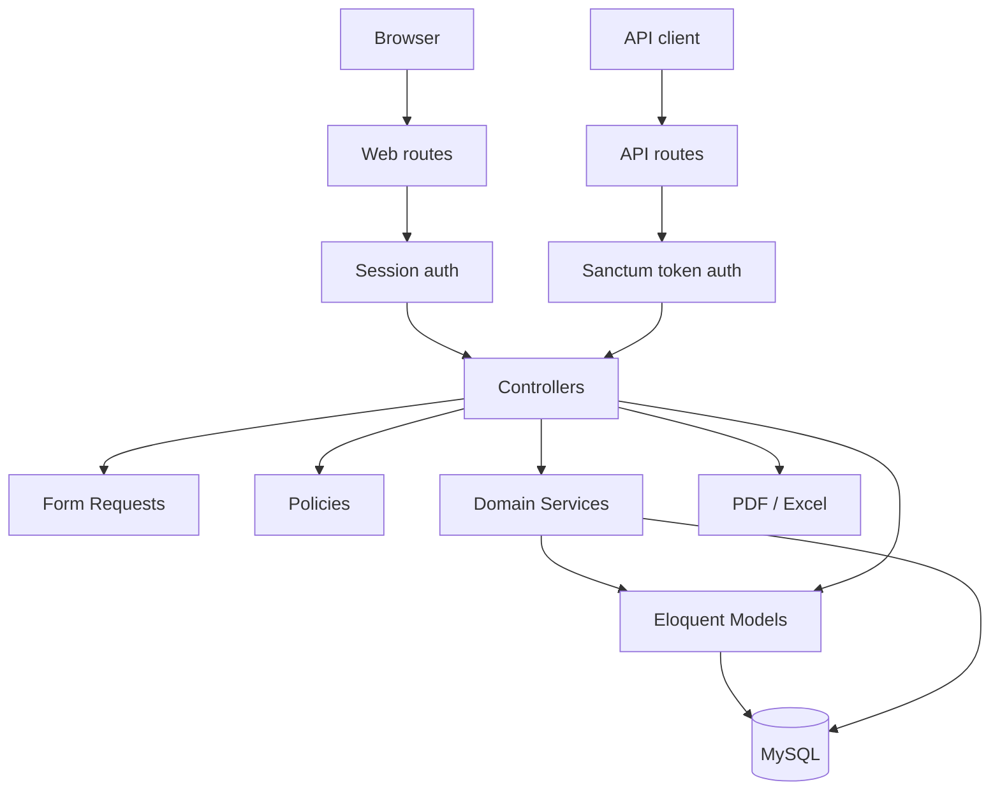
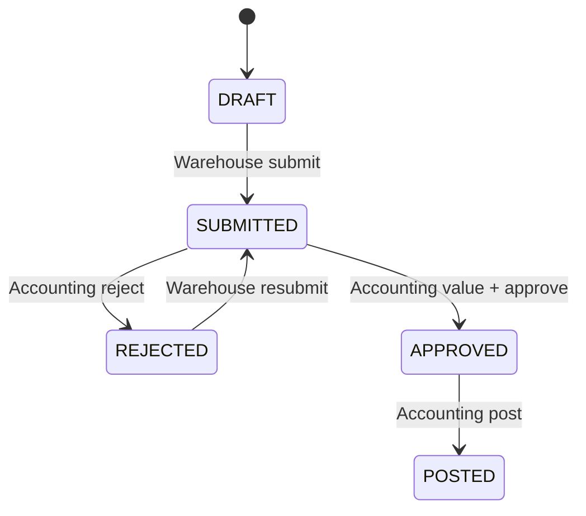
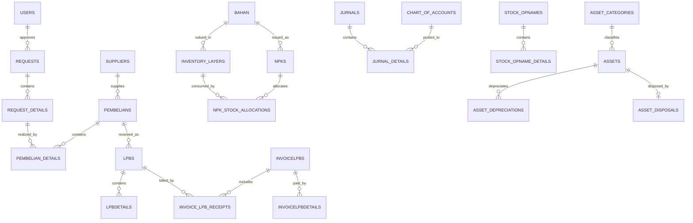

# WMS FullSpec — Technical Reference

Dokumen ini adalah referensi teknis untuk developer, DBA, QA, DevOps, dan maintainer. Isinya mengikuti route, controller, request validation, policy, model, migration, service, seeder, dan test pada codebase aktif.

> Dokumentasi produk dan alur bisnis tersedia di [README.md](README.md).

## 1. Technical baseline

| Komponen | Implementasi |
|---|---|
| Backend | PHP 8.1+, Laravel 10 |
| Database | MySQL sebagai default |
| Web auth | Laravel session guard `web`, provider model `User` |
| API auth | Laravel Sanctum, provider model `User` |
| UI | Blade, Bootstrap 5, jQuery, DataTables |
| Asset build | Vite 5 |
| Report | DomPDF, TCPDF, Laravel Excel |
| Test | PHPUnit 10 |
| Bentuk aplikasi | Modular monolith |

Codebase hanya memuat WMS baru. Route, controller, model, view, API, import/export, middleware autentikasi, dan dependency JWT dari implementasi sebelumnya sudah dihapus.

## 2. Arsitektur



### 2.1 Lapisan kode

| Lapisan | Lokasi | Tanggung jawab |
|---|---|---|
| Route | `routes/web.php`, `routes/api.php` | Endpoint dan middleware |
| Middleware | `app/Http/Middleware` | Session, CSRF, rate limit, binding |
| Controller | `app/Http/Controllers` | Orkestrasi use case dan response |
| Form Request | `app/Http/Requests` | Validasi dan sebagian authorization |
| Policy | `app/Policies` | Role serta status document guard |
| Service | `app/Services` | Accounting, FIFO, opname, asset, numbering |
| Model | `app/Models` | Mapping tabel, relasi, cast, helper domain |
| Persistence | `database/migrations`, `database/seeders` | Schema, constraint, master/demo data |
| Presentation | `resources/views` | Blade page, dashboard, dan report template |

Perubahan stok/nilai penting dibungkus `DB::transaction()`. Row yang rawan race memakai `lockForUpdate()`, termasuk inventory layer dan document sequence.

## 3. Authentication

### 3.1 Web login

Web menggunakan mekanisme Laravel standar:

1. `GET /` menampilkan form login melalui guest middleware.
2. `POST /login` memvalidasi email/password.
3. `Auth::attempt()` memeriksa credential terhadap tabel `users`.
4. Jika berhasil, session ID diregenerasi untuk mencegah session fixation.
5. User diarahkan ke intended URL atau `/dashboard`.
6. Seluruh route bisnis memakai middleware `auth`.
7. Logout menjalankan `Auth::logout()`, invalidate session, dan regenerate CSRF token.

Tidak ada request login, token, atau profil user yang dikirim ke service eksternal.

### 3.2 User model

Tabel `users` memiliki field:

- `id`;
- `name`;
- `email` unique;
- `email_verified_at` nullable;
- `password` hash;
- `type` unsigned small integer, indexed, default `0`;
- `remember_token`;
- timestamps.

Model `User` memakai `HasApiTokens`, `HasFactory`, dan `Notifiable`. Password menggunakan cast `hashed`; `type` menggunakan cast integer.

Nilai `type=0` sengaja tidak memiliki capability bisnis. Ini menjadi default aman bagi user yang belum diberi role.

### 3.3 Development accounts

`UserSeeder` membuat akun berikut:

| Email | Password | Type | Role |
|---|---|---:|---|
| `purchasing@wms.local` | `Wms12345!` | 5 | Purchasing |
| `finance@wms.local` | `Wms12345!` | 13 | Finance/AP Payment |
| `warehouse@wms.local` | `Wms12345!` | 14 | Gudang |
| `accounting@wms.local` | `Wms12345!` | 33 | Accounting |

Password tersebut hanya untuk development/demo. Jangan gunakan pada production.

### 3.4 API authentication

API aktif hanya:

```text
GET /api/user
Middleware: auth:sanctum
Response: authenticated User
```

Token Sanctum terhubung ke model dan tabel `users`. Belum ada endpoint pembuatan/revocation token; provisioning token dilakukan melalui proses admin/Tinker sampai UI pengelolaan token tersedia.

## 4. Authorization

Policies sekarang menerima `App\Models\User`, bukan virtual/external user.

| Capability | Type 5 | Type 13 | Type 14 | Type 33 |
|---|:---:|:---:|:---:|:---:|
| Lihat bahan | ✓ | ✓ | ✓ | ✓ |
| Lihat nilai/harga | ✓ | — | — | ✓ |
| Kelola supplier | ✓ | — | — | — |
| Buat request | ✓ | — | ✓ | — |
| Approve request | ✓ | — | — | ✓ |
| Kelola PO | ✓ | — | — | ✓ |
| Buat/ubah LPB | ✓ | — | ✓ | — |
| Buat/ubah NPK | ✓ | — | ✓ | ✓ |
| Buat invoice | ✓ | — | — | ✓ |
| Bayar/void payment | — | ✓ | — | — |
| Hitung/submit opname | — | — | ✓ | — |
| Valuasi/approve/post opname | — | — | — | ✓ |
| COA/jurnal/tax/period lock | — | — | — | ✓ |
| Asset financial action | — | — | — | ✓ |
| Kelola procurement jasa | ✓ | — | terbatas | ✓ |

Policy juga memeriksa state document. Contoh: LPB harus belum terkunci, jurnal harus manual dan draft, invoice tidak boleh memiliki payment untuk perubahan tertentu, serta opname harus berada pada state yang tepat.

## 5. Struktur source

```text
app/
├── Console/Commands/       maintenance master data
├── Exports/                export stock opname aktif
├── Http/
│   ├── Controllers/        controller WMS baru
│   ├── Middleware/         middleware Laravel
│   └── Requests/           validation objects
├── Models/                 model WMS baru + User
├── Policies/               authorization berbasis User.type
├── Providers/              Laravel providers
└── Services/               accounting, FIFO, numbering, opname, asset
database/
├── migrations/             schema dan hardening
├── seeders/                user, master, serta data demo
└── factories/
resources/views/            halaman WMS baru dan report template
routes/                     web, API, console
tests/                      unit dan feature tests
```

## 6. Modul aktif

| Modul | Controller | Model/tabel utama | Service |
|---|---|---|---|
| Auth/dashboard | `AuthController` | `User`, `users` | Laravel Auth |
| Supplier | `SupplierController` | `Supplier`, `suppliers` | — |
| Bahan | `BahanController` | `Bahan`, `bahan` | helper konversi unit |
| Request | `RequestController`, `RequestdetailController` | `requests`, `request_details` | numbering |
| PO barang | `PembelianController`, `PembeliandetailController` | `pembelians`, details | numbering |
| LPB | `LpbController` | `lpbs`, `lpbdetails`, layers | WMS accounting |
| NPK | `NpkController` | `npks`, stock allocations | WMS accounting |
| Invoice/AP | invoice controllers | invoice, receipt, payment tables | accounting + allocation |
| Stock opname | `StockOpnameController` | opname tables | `StockOpnameService` |
| General ledger | jurnal controllers | `jurnals`, `jurnal_details` | period + numbering |
| Accounting setup | COA/category/tax/lock controllers | setup/control tables | period service |
| Rekonsiliasi | `AccountingReconciliationController` | read model inventory/accounting | — |
| Fixed asset | asset controllers | asset tables | asset accounting |
| Procurement jasa | service controllers | service category/PO/BAP tables | WMS accounting at invoice |
| Multi-warehouse | warehouse controllers | `gudangs`, `stok_gudangs`, transfer, mutasi, Consider | stok, transfer, pemeriksaan, rekonsiliasi |

### 6.1 Multi-warehouse v1

Jenis gudang aktif adalah `NORMAL`, `CONSIDER`, dan `RUSAK`. `gudangs` menggantikan master `admin_namagudang`. Saldo operasional disimpan pada `stok_gudangs` dengan unique key `(gudang_id, bahan_id)`, sementara `bahan.stok_onhand` dipertahankan sementara sebagai cache agregat kompatibilitas.

Tabel utama:

- `gudangs`: master dan capability gudang;
- `stok_gudangs`: tersedia, direservasi, dan dipesan per barang–gudang;
- `pembagian_gudangs`: kesiapan pembatasan user per gudang; v1 belum membatasi sesama type 14;
- `pengaturan_bahan_gudangs`: minimum, maksimum, safety stock, dan reorder point;
- `mutasi_stoks`: ledger immutable seluruh perubahan saldo;
- `transfer_gudangs`, `detail_transfer_gudangs`, `alokasi_transfer_gudangs`: dokumen serta penjagaan cost layer transfer;
- `pemeriksaan_considers`, `detail_pemeriksaan_considers`: keputusan baik/rusak yang final.

Posting stok selalu berada di `DB::transaction()`, mengunci `stok_gudangs` dan `inventory_layers`, lalu memperbarui saldo, layer, mutasi, dan jurnal terkait secara atomik. Transfer biasa dilarang dari Gudang Consider/Rusak, dan tujuan Rusak hanya dapat dicapai melalui konfirmasi pemeriksaan Consider.

Satu PO memiliki satu `gudang_id`. LPB mewarisi gudang PO; NPK wajib memiliki gudang asal; stock opname membaca snapshot dari `stok_gudangs`. Rekonsiliasi membandingkan saldo per gudang dengan total remaining quantity layer pada gudang yang sama.

## 7. Domain flow dan invariant

### 7.1 Request → approval → PO

- Header request berstatus `pending`, `approved`, atau `rejected`.
- Detail menyimpan snapshot bahan, unit, gudang, jumlah minta/approved, dan realisasi.
- PO detail dapat mengacu ke `request_detail_id`.
- Realisasi request dan `stok_onpurchase` disinkronkan ketika detail PO berubah.
- PO menyimpan financial components, delivery term, status close, dan history snapshot.

### 7.2 LPB

- LPB mengacu ke PO dan surat jalan.
- Penerimaan tidak boleh melebihi outstanding PO.
- Detail menyimpan bahan, kategori, lot, qty, harga, pemakaian, dan sisa.
- Posting menambah `stok_gudangs` pada gudang PO, membuat `inventory_layers` pada gudang yang sama, dan menyegarkan `bahan.stok_onhand` sebagai cache agregat kompatibilitas.
- Jurnal LPB:

| Debit | Kredit | Amount |
|---|---|---:|
| Persediaan kategori | GRNI kategori | received qty × price |

### 7.3 NPK dan FIFO

- Input dapat memakai base unit atau small unit.
- Konversi disimpan sebagai snapshot `jumlah_stok` dan `satuan_transaksi`.
- Hanya saldo dan layer pada gudang asal NPK yang dapat dikonsumsi; layer dengan tanggal/ID tertua dikonsumsi lebih dahulu.
- Alokasi disimpan di `npk_stock_allocations`.
- Update/delete mengembalikan saldo layer sebelum kalkulasi ulang.
- Jurnal NPK: debit beban kategori, kredit persediaan berdasarkan biaya FIFO.

### 7.4 Supplier invoice dan payment

- Invoice menghubungkan satu atau lebih LPB/BAP melalui `invoice_lpb_receipts`.
- Invoice menyimpan DPP, tax, discount, freight, total, paid amount, dan outstanding.
- Posting invoice menyelesaikan GRNI dan mengakui hutang usaha.
- Payment mendukung partial/full payment, PPh 23, bank fee, stamp duty, difference, dan supplier advance.
- Void membuat reversal; transaksi finansial posted tidak dihapus langsung.

### 7.5 Stock opname



- Warehouse mengonfirmasi physical quantity dan reason.
- Accounting menentukan valuation.
- Negative difference memakai FIFO.
- Positive difference membutuhkan correction unit cost dan membuat layer baru.
- Posting ditolak bila stock berubah sejak system quantity dicatat.

### 7.6 Fixed asset

- Asset category memetakan asset, accumulated depreciation, expense, gain, dan loss COA.
- Acquisition type menentukan account lawan yang valid.
- Depreciation tidak boleh melewati residual value.
- Sale/write-off menutup cost dan accumulated depreciation serta mencatat gain/loss.

### 7.7 Service procurement

- `ServicePurchase` memakai discriminator `document_type=SERVICE` pada PO.
- `ServiceBap` memakai `document_type=SERVICE_BAP` pada LPB.
- Operational service dapat membutuhkan cost center.
- Production service dapat membutuhkan Data Pesanan dan masuk WIP.
- BAP tidak membentuk jurnal saat dibuat; journal terbentuk ketika invoice diposting.

## 8. Accounting services

| Service | Tanggung jawab |
|---|---|
| `WmsAccountingService` | LPB/NPK/invoice/payment journal, FIFO consume/restore, reversal |
| `StockOpnameService` | physical confirmation, valuation, adjustment posting |
| `AssetAccountingService` | acquisition, depreciation, disposal journal |
| `AccountingPeriodService` | menolak posting pada period `LOCKED` |
| `InventoryCostCalculator` | weighted average lima layer aktif terbaru |
| `PaymentAllocationService` | AP reduction, difference, supplier advance |
| `DocumentNumberService` | atomic external/financial/internal numbering |

Guardrail:

- debit dan kredit wajib seimbang dengan tolerance Rp0,01;
- COA wajib active dan postable;
- account category serta normal balance harus sesuai mapping purpose;
- cash/bank account harus memiliki `is_cash_bank`;
- automatic journal idempotent berdasarkan source + reference ID;
- cancellation memakai reversal;
- period lock diperiksa sebelum financial posting.

## 9. Database

### 9.1 Tabel aktif

| Kelompok | Tabel |
|---|---|
| Auth/framework | `users`, `password_reset_tokens`, `personal_access_tokens`, `failed_jobs` |
| Master | `suppliers`, `gudangs`, `bahan`, `kategoribahan`, `tipe_pembebanans` |
| Multi-gudang | `stok_gudangs`, `pembagian_gudangs`, `pengaturan_bahan_gudangs`, `mutasi_stoks`, `transfer_gudangs`, `detail_transfer_gudangs`, `alokasi_transfer_gudangs`, `pemeriksaan_considers`, `detail_pemeriksaan_considers` |
| Request | `requests`, `request_details` |
| Purchase | `pembelians`, `pembelian_details`, purchase history tables |
| Receipt | `lpbs`, `lpbdetails` |
| Inventory valuation | `inventory_layers`, `npk_stock_allocations` |
| Issue | `npks` |
| Accounts payable | `invoicelpbs`, `invoice_lpb_receipts`, `invoicelpbdetails` |
| Ledger | `chart_of_accounts`, `accounting_settings`, `jurnals`, `jurnal_details` |
| Controls | `accounting_period_locks`, `tax_rates`, `document_sequences` |
| Opname | `stock_opnames`, `stock_opname_details`, `stock_opname_allocations` |
| Asset | `asset_categories`, `assets`, `asset_depreciations`, `asset_disposals` |
| Service | `service_categories`, `service_po_details`, `service_bap_details`, `service_bap_allocations` |
| Reference | `kredits`, `debits` |

### 9.2 Relasi inti



### 9.3 Precision dan consistency

- Quantity inventory: `decimal(18,6)`.
- Unit cost: empat decimal pada layer/allocation.
- Financial amount: umumnya `decimal(18,2)`.
- Inventory layer memakai `source_type/source_id` untuk LPB atau correction source.
- Journal memakai `sumber_transaksi/reff_id` sebagai domain reference.
- User operational ID sekarang berasal dari `users.id`.

### 9.4 Migration auth

Migration `2026_08_07_000001_add_type_to_users_table.php` menambahkan `users.type` dengan default `0` dan index. Default tersebut memberi zero business privilege sampai admin menetapkan role.

## 10. Seeder

Urutan `DatabaseSeeder`:

1. membuat/update empat user contoh lewat `UserSeeder`;
2. membuat tax, COA, accounting settings, category, warehouse, supplier, material, asset category, dan service category;
3. menjalankan `WmsDemoSeeder`;
4. menjalankan `WmsTransactionScenarioSeeder`;
5. menjalankan `AssetAndServiceDemoSeeder`.

Karena tiga seeder terakhir membuat transaksi demo, `php artisan migrate --seed` hanya boleh dipakai pada development/test. Production harus menggunakan `php artisan migrate --force` dan provisioning master data terpisah.

## 11. Configuration

Repository belum menyediakan `.env.example`. Minimum:

```dotenv
APP_NAME="WMS FullSpec"
APP_ENV=local
APP_KEY=
APP_DEBUG=true
APP_URL=http://localhost:8000

DB_CONNECTION=mysql
DB_HOST=127.0.0.1
DB_PORT=3306
DB_DATABASE=wms
DB_USERNAME=
DB_PASSWORD=

SESSION_DRIVER=file
SESSION_LIFETIME=120
CACHE_DRIVER=file
QUEUE_CONNECTION=sync
```

Untuk production gunakan `APP_DEBUG=false`, HTTPS, dan `SESSION_SECURE_COOKIE=true`.

## 12. Installation

Development:

```bash
composer install
npm install
# buat .env
php artisan key:generate
php artisan migrate --seed
npm run build
php artisan serve
```

Production:

```bash
composer install --no-dev --classmap-authoritative
npm ci
npm run build
php artisan migrate --force
php artisan optimize
```

Document root harus menunjuk ke `public/`. Folder `storage/` dan `bootstrap/cache/` harus writable.

## 13. CLI

| Command | Fungsi |
|---|---|
| `php artisan bahan:update-status {file}` | Update category/type bahan dari XLSX |
| `php artisan route:list` | Audit endpoint aktif |
| `php artisan migrate:status` | Audit migration |
| `php artisan test` | Jalankan PHPUnit |
| `php artisan optimize` | Cache production configuration/routes/views |

Tidak ada scheduled domain command dan queue job aktif; transaksi diproses sinkron.

## 14. Testing

Suite mencakup:

- policy role Accounting, Purchasing, Finance, dan Warehouse;
- financial visibility;
- COA safety;
- asset/service policy;
- payment allocation;
- unit conversion;
- inventory cost calculation;
- stock opname state/role;
- basic application response.

`phpunit.xml` memakai array cache/session dan sync queue. SQLite in-memory masih dikomentari. Gunakan database test terpisah bila menambah integration test.

Area berikut perlu tambahan test:

- login success/failure/remember/logout dengan database;
- user type migration dan seeder;
- full request → PO → LPB → invoice → payment;
- concurrent FIFO dan document numbering;
- API Sanctum token lifecycle;
- PDF/Excel rendering;
- migration production rehearsal.

## 15. Security notes

- Password disimpan melalui hashed cast.
- Login failure tidak membocorkan apakah email terdaftar.
- Session diregenerasi setelah login dan di-invalidate saat logout.
- CSRF aktif pada seluruh web mutation.
- Authorization harus tetap dilakukan server-side melalui policy.
- Type `0` adalah default tanpa capability.
- Akun demo wajib diganti/dihapus pada production.
- Secret, token, dan `.env` tidak boleh masuk repository.

## 16. Current technical debt

1. Belum ada `.env.example`.
2. Belum ada UI admin untuk membuat user, mengganti password, menetapkan type, dan revoke token.
3. Login belum memiliki rate limiter khusus selain proteksi web server umum.
4. `DatabaseSeeder` mencampur master dan transaksi demo.
5. API belum mempunyai issuance/revocation endpoint dan OpenAPI spec.
6. Frontend kritis masih memuat dependency CDN.
7. Metadata `composer.json` masih generik Laravel skeleton.
8. Belum ada CI/CD definition.
9. Belum ada integration test MySQL untuk workflow finansial penuh.
10. Penamaan beberapa class/tabel mempertahankan istilah lama dan casing yang tidak seragam.

## 17. Recommended hardening

1. Tambahkan `.env.example` tanpa secret.
2. Buat user administration khusus type 33 dengan password reset aman.
3. Tambahkan login throttle dan audit login event.
4. Pisahkan `MasterDataSeeder` dan `DemoSeeder`.
5. Tambahkan OpenAPI dan token management untuk Sanctum.
6. Tambahkan CI: Composer validate, PHP lint/Pint, PHPUnit, route boot, npm build, secret scan.
7. Tambahkan MySQL integration test dan race-condition test.
8. Bundle dependency frontend agar intranet tidak bergantung CDN.
9. Tambahkan runbook backup, restore, reconciliation, dan incident response.

## 18. Safe change checklist

Sebelum mengubah inventory/accounting flow:

- identifikasi policy dan document state;
- periksa period lock;
- gunakan DB transaction;
- gunakan row lock untuk stock/sequence/balance;
- pertahankan precision quantity dan amount;
- jaga journal balanced serta idempotent;
- gunakan reversal, bukan delete journal posted;
- sinkronkan aggregate stock, layer, allocation, source detail, dan journal;
- tambah test untuk happy path, invalid state, dan concurrency;
- audit bahwa type 14 tidak menerima financial value.

## 19. Source of truth

Jika dokumentasi dan kode berbeda:

1. migration untuk schema;
2. `php artisan route:list` untuk endpoint;
3. policy untuk permission;
4. Form Request/controller untuk workflow;
5. service untuk invariant accounting/FIFO;
6. model untuk relation/cast;
7. test untuk behavior guarantee.
